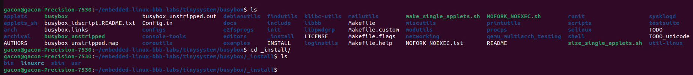
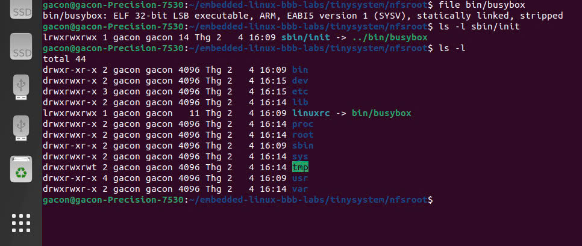

# TUẦN 3: QUY TRÌNH BUILD ROOT FILESYSTEM VỚI BUSYBOX

Tuần này tập trung vào việc xây dựng **root filesystem (rootfs)** tối giản cho hệ thống Embedded Linux, sử dụng **BusyBox** ở chế độ **static**.

---

## 1. Mục tiêu

- Xây dựng **rootfs** gọn nhẹ bằng **BusyBox (static)**
- Thiết lập cấu trúc thư mục rootfs đúng chuẩn Linux
- Bổ sung các file cấu hình hệ thống bắt buộc để kernel có thể khởi động
- Chuẩn bị, phân vùng và định dạng **SD card** để chứa rootfs

---

## 2. Chuẩn bị môi trường làm việc

```bash
cd ~/embedded-linux-bbb-labs/tinysystem
mkdir -p nfsroot
```

Thư mục `nfsroot` đóng vai trò là **root filesystem trên host**, sau khi hoàn tất sẽ được copy sang SD card.

---

## 3. Clone mã nguồn BusyBox và checkout phiên bản ổn định

```bash
git clone https://git.busybox.net/busybox
cd busybox
git checkout 1_37_stable
```

- Sử dụng nhánh **1.37.x stable** để đảm bảo tính ổn định.

---

## 4. Cấu hình BusyBox (static – bước khởi đầu)

### 4.1. Khai báo biến môi trường và toolchain

```bash
export ARCH=arm
export CROSS_COMPILE=arm-cong-linux-musleabihf-
export PATH=$HOME/x-tools/arm-cong-linux-musleabihf/bin:$PATH
```

### 4.2. Cấu hình BusyBox

```bash
make menuconfig
```

Cần **bắt buộc kiểm tra** các tuỳ chọn sau:

```
Settings  --->
  [*] Build static binary (no shared libs)
  Install Options  --->
    (../nfsroot) Destination path for 'make install'
```

- Build **static** giúp hệ thống chưa cần phụ thuộc vào thư viện C bên ngoài.

---

## 5. Build và cài đặt BusyBox

```bash
make -j$(nproc)
make install
```

Sau khi hoàn tất, thư mục rootfs ban đầu sẽ có cấu trúc:

```
nfsroot/
 ├── bin/
 ├── sbin/
 ├── usr/
 └── linuxrc -> bin/busybox
```

### Hình ảnh rootfs sau khi build BusyBox



---

## 6. Tạo cấu trúc thư mục root filesystem chuẩn Linux

```bash
cd ../nfsroot

mkdir -p \
  etc proc sys dev lib tmp var root \
  etc/init.d
```

Thiết lập permission cơ bản:

```bash
chmod 755 .
chmod 1777 tmp
```

---

## 7. Tạo các device node tối thiểu

```bash
sudo mknod -m 600 dev/console c 5 1
sudo mknod -m 666 dev/null c 1 3
sudo mknod -m 666 dev/tty c 5 0
```

- Thiếu `/dev/console` sẽ khiến kernel **panic ngay khi boot**.

---

## 8. Tạo các file cấu hình hệ thống

### 8.1. File `/etc/inittab`

```bash
cat > etc/inittab << 'EOF'
::sysinit:/etc/init.d/rcS
ttyS0::askfirst:/bin/sh
::ctrlaltdel:/sbin/reboot
::shutdown:/bin/umount -a -r
EOF
```

- Sử dụng `ttyS0` để làm console, cho phép thao tác và job control (Ctrl + C).

---

### 8.2. Script khởi động `/etc/init.d/rcS`

```bash
cat > etc/init.d/rcS << 'EOF'
#!/bin/sh

mount -t proc none /proc
mount -t sysfs none /sys
mount -t devtmpfs none /dev

echo "System booted successfully"
EOF
```

Cấp quyền thực thi:

```bash
chmod +x etc/init.d/rcS
```

---

### 8.3. Các file hệ thống cơ bản

```bash
echo "root:x:0:0:root:/root:/bin/sh" > etc/passwd
echo "root:x:0:" > etc/group

cat > etc/fstab << 'EOF'
proc  /proc proc  defaults 0 0
sysfs /sys  sysfs defaults 0 0
EOF
```

---

## 9. Kiểm tra rootfs trước khi copy sang SD card

Kiểm tra BusyBox:

```bash
file bin/busybox
```

Kết quả mong đợi:

```
statically linked
ARM
```

Kiểm tra init:

```bash
ls -l sbin/init
```

- File `init` phải là symlink trỏ về BusyBox.

### Các thư mục cần thiết trong rootfs



---

## 10. Copy rootfs sang SD card

Định dạng phân vùng rootfs:

```bash
sudo mkfs.ext4 /dev/mmcblk0p2
```

Mount và copy dữ liệu:

```bash
sudo mount /dev/mmcblk0p2 /mnt

sudo cp -a nfsroot/* /mnt/
sync

sudo umount /mnt
```

- Luôn sử dụng `cp -a` để giữ nguyên **symlink, permission và device node**.

---

## 11. Nội dung file `extlinux.conf`

```text
DEFAULT linux
TIMEOUT 1

LABEL linux
    KERNEL /zImage
    FDT /am335x-boneblack.dtb
    APPEND console=ttyS0,115200 root=/dev/mmcblk1p2 rootfstype=ext4 rw rootwait init=/sbin/init
```

---

## Kết quả boot trên BeagleBone Black


