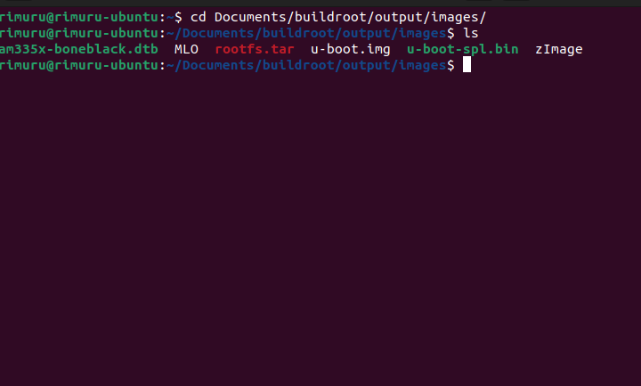
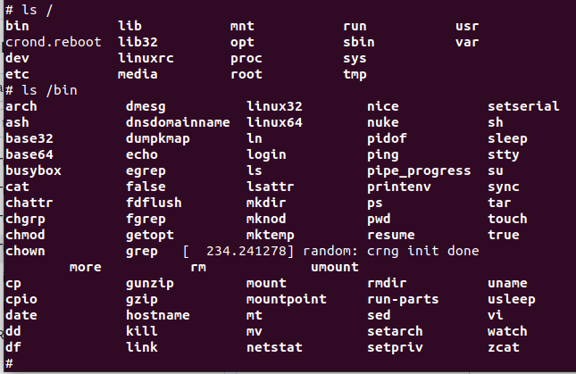
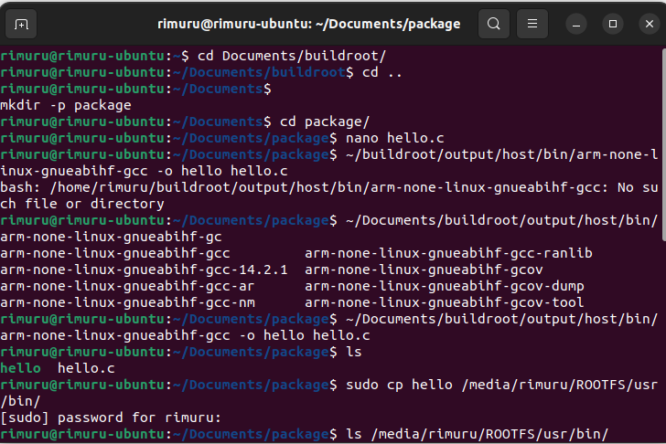
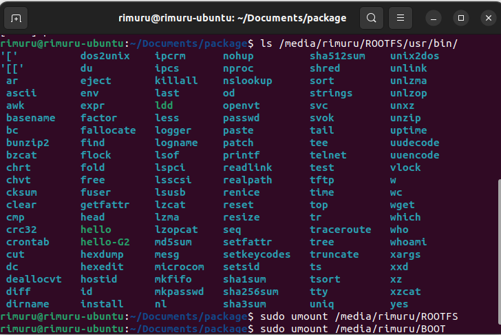
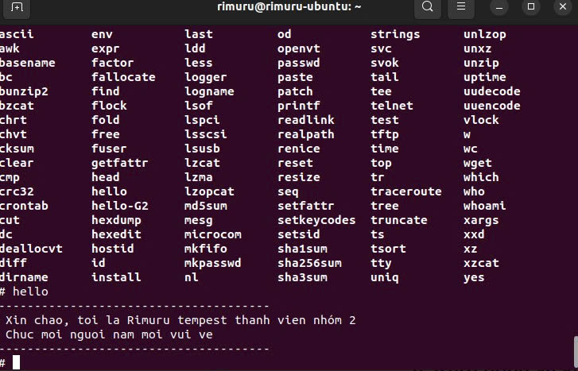
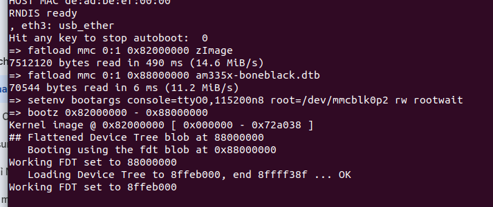
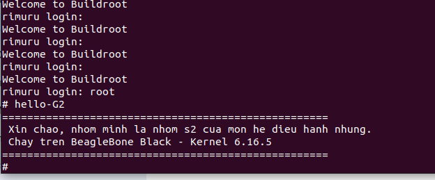

TUẦN 4: QUY TRÌNH BUILD HỆ ĐIỀU HÀNH BẰNG CÔNG CỤ BUILDROOT - NHÓM 2

## Mục tiêu

Thực hiện build toàn bộ hệ điều hành Linux nhúng bằng Buildroot cho board BeagleBone Black (BBB) và tích hợp một ứng dụng C tùy chỉnh (hello-G2) vào hệ thống file rootfs.

## Yêu cầu môi trường

- Hệ điều hành phát triển: Ubuntu (phiên bản hiện đại)
- Packages cần cài đặt (chạy trên host):

```bash
sudo apt-get update && sudo apt-get install -y \
  build-essential git wget curl cpio unzip rsync file bc \
  bison flex gawk texinfo libssl-dev libgnutls28-dev uuid-dev \
  libncurses5-dev libncursesw5-dev libglib2.0-dev libpixman-1-dev \
  python3 python3-matplotlib asciidoc w3m dblatex graphviz \
  patch diffutils perl sed tar gzip bzip2 findutils make binutils
```
### I. BUILDROOT (1)
## 1. Clone Buildroot và chọn nhánh ổn định

```bash
git clone https://git.buildroot.net/buildroot
cd buildroot
git branch -a
# Ví dụ chọn phiên bản ổn định
git checkout 2025.08
```

## 2. Cấu hình cho BeagleBone Black

Chạy giao diện cấu hình:

```bash
make menuconfig
```

Các thiết lập quan trọng (tham khảo trong giao diện):
- Target Options: `Arm (little endian)`, Variant: `cortex-A8`
- Toolchain: `External toolchain` (hoặc in-tree nếu bạn muốn)
- System Configuration: `System hostname: rimuru`, `System banner: Welcome to Rimuru - Nhom S2 OS`
- Kernel: `zImage`, Defconfig: `omap2plus`, DTS in-tree: `ti/omap/am335x-boneblack`
- Bootloaders: `u-boot` (board `am335x_evm`), Binary format: `u-boot.img`

Ghi chú: bật `Target Packages` → thêm package tùy chỉnh (xem phần 4).

## 3. Build toàn bộ hệ thống

Quá trình build có thể mất 40–60 phút tùy host:

```bash
make 2>&1 | tee build.log
```

Các file đầu ra chính nằm trong `output/images/`:
- Boot: `MLO`, `u-boot.img`, `zImage`, `am335x-boneblack.dtb`
- Rootfs: `rootfs.tar` (hoặc các định dạng khác tùy cấu hình)



Cắm thẻ nhớ vào BBB và chạy ta được 



### II. BUILD DRIVE BY TOOLCHAIN (2)

## 1. Tạo mã nguồn C trên máy host

Tạo thư mục và file .c bằng câu lệnh

```bash
cd ~/Documents
mkdir ~/package
cd ~/package
nano hello.c
```

```c
#include <stdio.h>

int main(void) {
    printf("--------------------------------------\n");
    printf(" Xin chao, toi la Rimuru tempest thanh vien nhóm 2 \n");
    printf(" Chuc moi nguoi nam moi vui ve \n");
    printf("--------------------------------------\n");
    return 0;
}
```
## 2. Sử dụng toolchain của buildroot để biên dịch
Đường dẫn của tôi là: 

```bash 
~/Documents/buildroot/output/host/bin/arm-none-linux-gnueabihf-gcc
```

Sử dụng câu lệnh
```bash
~/Documents/buildroot/output/host/bin/arm-none-linux-gnueabihf-gcc -o hello hello.c
```




## 3. Đưa chương trình vào RootFS trên thẻ nhớ

Copy file thực thi:

# Copy file 'hello_g5' vừa tạo vào thư mục /usr/bin trên thẻ nhớ
```bash
sudo cp hello /media/rimuru/ROOTFS/usr/bin/
```
## 4. Chạy thử lệnh trên BBB
Chạy lệnh:
```bash
hello
```



### III. BUILD PACKAGE (3)
## 1. Tạo và tích hợp package tùy chỉnh `hello-G2`

1) Tạo cấu trúc package:

```bash
mkdir -p package/hello-G2/src
```

2) Tạo file nguồn `package/hello-G2/src/hello.c` với nội dung:

```c
#include <stdio.h>

int main(void) {
    printf("====================================================\n");
    printf(" Xin chao, nhom minh la nhom s2 cua mon he dieu hanh nhung.\n");
    printf(" Chay tren BeagleBone Black - Kernel 6.16.5\n");
    printf("====================================================\n");
    return 0;
}
```

3) Tạo file build `package/hello-G2/hello-G2.mk`:

```make
HELLO_G2_VERSION = 1.0
HELLO_G2_SITE = $(TOPDIR)/package/hello-G2/src
HELLO_G2_SITE_METHOD = local

define HELLO_G2_BUILD_CMDS
	$(TARGET_CC) $(TARGET_CFLAGS) $(@D)/hello.c -o $(@D)/hello-G2 $(TARGET_LDFLAGS)
endef

define HELLO_G2_INSTALL_TARGET_CMDS
	$(INSTALL) -D -m 0755 $(@D)/hello-G2 $(TARGET_DIR)/usr/bin/hello-G2
endef

$(eval $(generic-package))
```

4) Đăng ký package: thêm dòng sau vào `package/Config.in` (chèn vào trước `endmenu` cuối cùng):

```text
menu "Nhom S2 Custom Apps"
    source "package/hello-G2/Config.in"
endmenu
```

5) Chạy `make menuconfig` → `Target Packages` → `Nhom S2 Custom Apps` → chọn `hello-G2` → lưu cấu hình.

6) Build lại:

```bash
make 2>&1 | tee build.log
```

Sau khi build, file thực thi `hello-G2` sẽ được cài vào `usr/bin/` trong rootfs.

## 2. Ghi sang thẻ SD (ví dụ trên Linux host)

1) Gắn thẻ SD vào máy và xác định thiết bị 
2) Tạo filesystem rootfs :

```bash
sudo rm -rf /media/rimuru/ROOTFS/*
sudo tar -C /media/rimuru/ROOTFS/ -xf output/images/rootfs.tar
sync
sudo umount /media/rimuru/ROOTFS
```

## 3. Khởi động và kiểm tra trên BBB

Trong U-Boot, bạn có thể dùng các lệnh:

```bash
fatload mmc 0:1 0x82000000 zImage
fatload mmc 0:1 0x88000000 am335x-boneblack.dtb
setenv bootargs console=ttyO0,115200n8 root=/dev/mmcblk0p2 rw rootwait
bootz 0x82000000 - 0x88000000
```



Sau khi kernel khởi động, đăng nhập bằng `root`, sau đó chạy:

```bash
hello-G2
```
Ta sẽ thấy thông báo chào từ nhóm S2.



