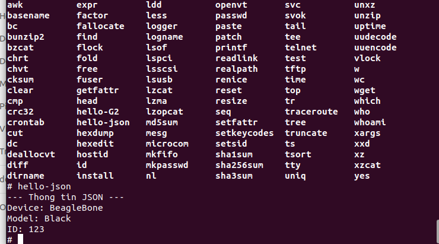
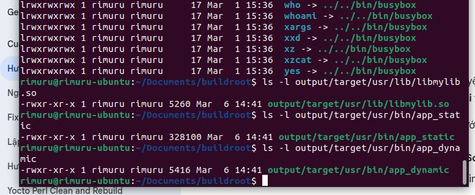
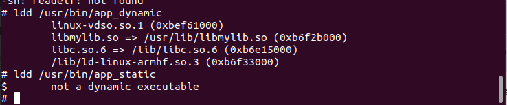
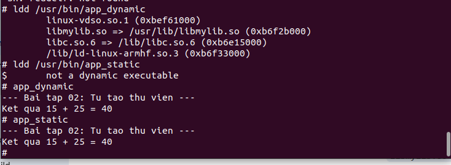
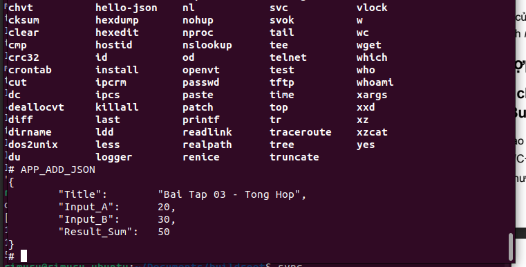

# TUẦN 5: Xây dựng hệ thống linh hoạt với Buildroot – Nhóm 2

## A. Mục tiêu

Tuần này thực hiện xây dựng và tích hợp các thư viện và ứng dụng người dùng vào hệ thống Linux nhúng bằng Buildroot. Các bài tập giúp hiểu rõ cách quản lý dependency, đóng gói thư viện và xây dựng ứng dụng sử dụng nhiều thư viện.

---

## Bài 1: Tích hợp thư viện cJSON

### 1. Giới thiệu

cJSON là một thư viện C nhỏ gọn dùng để tạo, parse và in JSON. Trong bài này tích hợp cJSON vào Buildroot và viết chương trình sử dụng thư viện này.

### 2. Cấu trúc package

```
package/Hello_Json
├── Config.in
├── HelloJSON.mk
└── src
    └── HelloJSON.c
```
### 3. Code chương trình (`HelloJSON.c`)
```c
#include <stdio.h>
#include <stdlib.h>
#include <cjson/cJSON.h> 

int main() {
    const char *json_string = "{\"name\":\"BeagleBone\", \"version\":\"Black\", \"id\":123}";
    cJSON *json = cJSON_Parse(json_string);
    
    if (json == NULL) {
        printf("Loi parse JSON!\n");
        return 1;
    }

    cJSON *name = cJSON_GetObjectItemCaseSensitive(json, "name");
    cJSON *version = cJSON_GetObjectItemCaseSensitive(json, "version");
    cJSON *id = cJSON_GetObjectItemCaseSensitive(json, "id");

    printf("--- Thong tin JSON tu Buildroot Package ---\n");
    if (cJSON_IsString(name)) printf("Device: %s\n", name->valuestring);
    if (cJSON_IsString(version)) printf("Model: %s\n", version->valuestring);
    if (cJSON_IsNumber(id)) printf("ID: %d\n", id->valueint);

    cJSON_Delete(json);
    return 0;
}
```

### 4. File `Hello_Json.mk`
```bash

HELLO_JSON_VERSION = 1.0
# $(HELLO_JSON_PKGDIR) trỏ đến thư mục package/Hello_Json/
HELLO_JSON_SITE = $(HELLO_JSON_PKGDIR)/src
HELLO_JSON_SITE_METHOD = local

HELLO_JSON_DEPENDENCIES = cjson

define HELLO_JSON_BUILD_CMDS
	$(TARGET_CC) $(TARGET_CFLAGS) $(@D)/HelloJSON.c -o $(@D)/Hello_Json $(TARGET_LDFLAGS) -lcjson
endef

define HELLO_JSON_INSTALL_TARGET_CMDS
	$(INSTALL) -D -m 0755 $(@D)/Hello_Json $(TARGET_DIR)/usr/bin/Hello_Json
endef

$(eval $(generic-package))
```

### 5. File `Config.in`
```
config BR2_PACKAGE_HELLO_JSON
	bool "Hello_Json"
	select BR2_PACKAGE_CJSON
	help
	  Chuong trinh parse JSON don gian cho bai tap BBB.
```

### 6. Đăng ký package
Thêm `source "package/Hello_Json/Config.in"` vào file `package/Config.in` gốc của Buildroot.

### 7. Build package
- Chạy `make menuconfig`
- Vào **Target packages → Hello_Json**
- Chọn package rồi `make`

### 8. Kết quả
- Binary `output/target/usr/bin/Hello_Json` được tạo.

### 9. Chạy thử trên BeagleBone Black

```bash
cd ~/Documents/buildroot/
sudo dd if=output/images/sdcard.img of=/dev/sda bs=4M status=progress conv=fsync
sync
```

```bash
sudo minicom -D /dev/ttyUSB0 -b 115200
```



---

## Bài 2: Thiết kế và đóng gói thư viện cá nhân `mylib`

### 1. Mục tiêu

Tạo thư viện `mylib` chứa hàm `int add(int a, int b);` hỗ trợ cả liên kết tĩnh (`.a`) và động (`.so`) và xây dựng ứng dụng để so sánh hai kiểu liên kết.

### 2. Cấu trúc package
```
package/mylib
│
├── Config.in
├── mylib.mk
└── src
    ├── mylib.c
    └── mylib.h
```

### 3. Nội dung các tệp nguồn

- Tạo cấu trúc thư mục:

```bash
cd ~/Documents/buildroot/package/
mkdir -p mylib/src
```
- Viết mã nguồn thư viện (trong package/mylib/src/):
- `mylib.h`:

```c
#ifndef MYLIB_H
#define MYLIB_H
int add(int a, int b);
#endif
```

- `mylib.c`:
```c
#include "mylib.h"
int add(int a, int b) {
    return a + b;
}
```
### 4. Tạo file package/mylib/Config.in
```bash
config BR2_PACKAGE_MYLIB
    bool "mylib"
    help
      Thu vien tu tao thuc hien phep cong.
```

### 5. Tạo file package/mylib/mylib.mk

```bash
MYLIB_VERSION = 1.0
MYLIB_SITE = $(MYLIB_PKGDIR)/src
MYLIB_SITE_METHOD = local
MYLIB_INSTALL_STAGING = YES

define MYLIB_BUILD_CMDS
	# Build Static (.a)
	$(TARGET_CC) $(TARGET_CFLAGS) -c $(@D)/mylib.c -o $(@D)/mylib.o
	$(TARGET_AR) rcs $(@D)/libmylib.a $(@D)/mylib.o
	# Build Dynamic (.so)
	$(TARGET_CC) $(TARGET_CFLAGS) -fPIC -shared $(@D)/mylib.c -o $(@D)/libmylib.so
endef

define MYLIB_INSTALL_STAGING_CMDS
	$(INSTALL) -D -m 0644 $(@D)/mylib.h $(STAGING_DIR)/usr/include/mylib.h
	$(INSTALL) -D -m 0755 $(@D)/libmylib.a $(STAGING_DIR)/usr/lib/libmylib.a
	$(INSTALL) -D -m 0755 $(@D)/libmylib.so $(STAGING_DIR)/usr/lib/libmylib.so
endef

define MYLIB_INSTALL_TARGET_CMDS
	$(INSTALL) -D -m 0755 $(@D)/libmylib.so $(TARGET_DIR)/usr/lib/libmylib.so
endef

$(eval $(generic-package))
```

### 6. Đăng ký package
Thêm `source "package/mylib/Config.in"` vào file `package/Config.in` gốc của Buildroot.

- Chạy `make menuconfig`
- Vào **Target packages → mylib**

### 7. TẠO ỨNG DỤNG TEST mylib_test

- Tạo cấu trúc thư mục
```bash
mkdir -p ~/Documents/buildroot/package/mylib_test/src
```
- Viết file package/mylib_test/src/main.c
```c
#include <stdio.h>
#include <mylib.h> 

int main() {
    printf("--- Bai tap 02: Tu tao thu vien ---\n");
    printf("Ket qua 15 + 25 = %d\n", add(15, 25));
    return 0;
}
```
- Tạo file package/mylib_test/mylib_test.mk

```bash
MYLIB_TEST_VERSION = 1.0
MYLIB_TEST_SITE = $(MYLIB_TEST_PKGDIR)/src
MYLIB_TEST_SITE_METHOD = local
MYLIB_TEST_DEPENDENCIES = mylib

define MYLIB_TEST_BUILD_CMDS
	<!-- LỗI: "ban Link Dong" và "ban Link Tinh" chía dập, nên sửa thành "bản Link Động" và "bản Link Tĩnh" -->
	# Build bản Link Động (Dynamic)
	$(TARGET_CC) $(TARGET_CFLAGS) $(@D)/main.c -o $(@D)/app_dynamic -lmylib
	# Build bản Link Tĩnh (Static)
	$(TARGET_CC) $(TARGET_CFLAGS) $(@D)/main.c -o $(@D)/app_static -L$(STAGING_DIR)/usr/lib -lmylib -static
endef

define MYLIB_TEST_INSTALL_TARGET_CMDS
	$(INSTALL) -D -m 0755 $(@D)/app_dynamic $(TARGET_DIR)/usr/bin/app_dynamic
	$(INSTALL) -D -m 0755 $(@D)/app_static $(TARGET_DIR)/usr/bin/app_static
endef

$(eval $(generic-package))
```

- Tạo file package/mylib_test/Config.in
```bash
config BR2_PACKAGE_MYLIB_TEST
    bool "mylib_test"
    select BR2_PACKAGE_MYLIB
    help
      Chuong trinh test de so sanh thu vien tinh va dong.
```

- Đăng ký package
Thêm `source "package/mylib_test/Config.in"` vào file `package/Config.in` gốc của Buildroot.

- Chạy `make menuconfig`
- Vào **Target packages → mylib_test**

- Build chương trình
```Bash
cd ~/Documents/buildroot/
make
```


### 8. So sánh Static và Dynamic Linking

| Loại liên kết   | Kích thước binary | Ưu điểm | Nhược điểm |
|-----------------|-------------------|---------|------------|
| Dynamic (shared)| ~5 KB             | - Kích thước nhỏ
- Sử dụng chung giữa nhiều chương trình
- Có thể cập nhật thư viện mà không cần biên dịch lại chương trình | - Phải có thư viện .so tại thời điểm chạy
- Có thể gây ra "dependency hell" nếu phiên bản không tương thích |
| Static          | ~328 KB           | - Binary tự chứa tất cả mã
- Chạy độc lập, không cần thư viện ngoài | - Kích thước lớn
- Cập nhật thư viện yêu cầu tái biên dịch
|

#### Kết quả phụ thuộc


```
$ ldd /usr/bin/app_dynamic
    libmylib.so => /usr/lib/libmylib.so
$ ldd /usr/bin/app_static
    not a dynamic executable
```
### 9. Giải thích chi tiết

- **Dynamic linking**: chương trình chứa các tham chiếu đến các hàm trong thư viện động. Khi chương trình khởi chạy, hệ thống tải thư viện `.so` và liên kết các biểu tượng tại thời gian chạy. Ưu điểm là kích thước nhị phân nhỏ và khả năng chia sẻ mã giữa nhiều tiến trình, đồng thời dễ cập nhật. Tuy nhiên, nó đòi hỏi quản lý phiên bản và đảm bảo thư viện tồn tại và tương thích.

- **Static linking**: tất cả mã cần thiết được nhúng trực tiếp vào file thực thi khi biên dịch, tạo ra một binary độc lập. Điều này đơn giản hóa phân phối và đảm bảo chương trình chạy mà không phụ thuộc vào môi trường, nhưng làm tăng kích thước và thao tác cập nhật thư viện đòi hỏi biên dịch lại.

---



## Bài 3: Ứng dụng tổng hợp `APP_ADD_JSON`

### 1. Mục tiêu

Xây dựng ứng dụng sử dụng đồng thời `cJSON` và `mylib` để kiểm chứng khả năng liên kết đa thư viện.

### 2. Cấu trúc package
```
package/APP_ADD_JSON
│
├── Config.in
├── APP_ADD_JSON.mk
└── src
    └── main.c
```

### 3. Code chương trình
```c
#include <stdio.h>
#include <cjson/cJSON.h>
#include <mylib.h>

int main()
{
    int a = 20;
    int b = 30;

    int sum = add(a, b);

    cJSON *root = cJSON_CreateObject();

    cJSON_AddStringToObject(root, "Title", "Bai Tap 03 - Tong Hop");
    cJSON_AddNumberToObject(root, "Input_A", a);
    cJSON_AddNumberToObject(root, "Input_B", b);
    cJSON_AddNumberToObject(root, "Result_Sum", sum);

    char *json_print = cJSON_Print(root);

    printf("%s\n", json_print);

    cJSON_Delete(root);

    return 0;
}
```

### 4. File `APP_ADD_JSON.mk`

```bash
APP_ADD_JSON_VERSION = 1.0
APP_ADD_JSON_SITE = $(APP_ADD_JSON_PKGDIR)/src
APP_ADD_JSON_SITE_METHOD = local

# Ràng buộc phải có 2 thư viện này thì mới build app
APP_ADD_JSON_DEPENDENCIES = cjson mylib

define APP_ADD_JSON_BUILD_CMDS
	# Sử dụng biến $(@D) để trỏ vào thư mục build tạm thời
	$(TARGET_CC) $(TARGET_CFLAGS) $(@D)/main.c -o $(@D)/APP_ADD_JSON \
		$(TARGET_LDFLAGS) -lcjson -lmylib
endef

define APP_ADD_JSON_INSTALL_TARGET_CMDS
	# Ép file thực thi vào thư mục /usr/bin trên SD Card
	$(INSTALL) -D -m 0755 $(@D)/APP_ADD_JSON $(TARGET_DIR)/usr/bin/APP_ADD_JSON
endef

$(eval $(generic-package))
```

### 5. File `Config.in`
```bash
config BR2_PACKAGE_APP_ADD_JSON
    bool "APP_ADD_JSON"
    select BR2_PACKAGE_CJSON
    select BR2_PACKAGE_MYLIB
    help
      Chuong trinh tong hop su dung cJSON (Bai 1) va mylib (Bai 2).
```

### 6. Build ứng dụng
- Chạy `make menuconfig` và bật `APP_ADD_JSON`.
- Build bằng `make`.

### 7. Kết quả
Binary `output/target/usr/bin/APP_ADD_JSON` được tạo.

### 8. Tạo SD card & Boot
```bash
cd ~/Documents/buildroot/
sudo dd if=output/images/sdcard.img of=/dev/sda bs=4M status=progress conv=fsync
sync
```

### 9. Chạy chương trình trên thiết bị
```bash
$ APP_ADD_JSON
{
 "Title": "Bai Tap 03 - Tong Hop",
 "Input_A": 20,
 "Input_B": 30,
 "Result_Sum": 50
}
```


