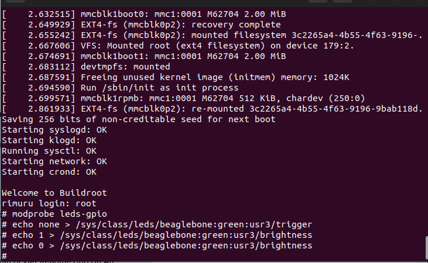
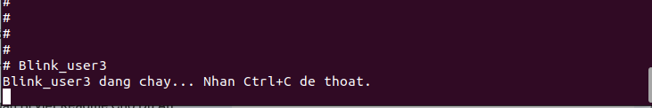
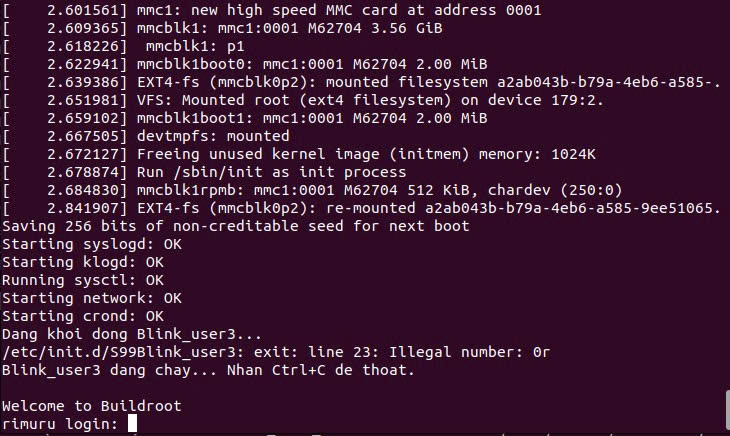

# BeagleBone Black — LED GPIO Kernel Driver Series

> **Nhóm 2** | Chuỗi 3 bài sử dụng Linux Kernel Driver điều khiển LED trên BeagleBone Black (BBB) với hệ điều hành tùy chỉnh từ Buildroot.

---

## Mục lục

- [Bài 1: Kernel Driver GPIO LED](#bài-1-kernel-driver-gpio-led)
- [Bài 2: User-space Blink Application](#bài-2-user-space-blink-application)
- [Bài 3: Auto-Start Service](#bài-3-auto-start-service)

---

## Bài 1: Kernel Driver GPIO LED

### Mục tiêu

Nạp driver `leds-gpio` và điều khiển LED thông qua Sysfs.

### Lệnh thực hiện

```bash
# Nạp module
modprobe leds-gpio

# Kiểm tra LED
ls /sys/class/leds/beaglebone:green:usr3/
```

### Điều khiển LED trực tiếp

```bash
# Tắt trigger mặc định
echo none > /sys/class/leds/beaglebone:green:usr3/trigger

# Bật LED
echo 1 > /sys/class/leds/beaglebone:green:usr3/brightness

# Tắt LED
echo 0 > /sys/class/leds/beaglebone:green:usr3/brightness
```

### Kết quả



- LED có thể điều khiển trực tiếp bằng lệnh shell
- Xác nhận driver hoạt động đúng

---

## Bài 2: User-space Blink Application

### Mục tiêu

Phát triển ứng dụng C `Blink_user3` tích hợp vào Buildroot để nhấy LED USR3.

### Cấu trúc thư mục

```
package/Blink_user3/
├── Config.in
├── Blink_user3.mk
└── src/
    └── Blink_user3.c
```

### File `Config.in`

```kconfig
config BR2_PACKAGE_BLINK_USER3
    bool "Blink_user3"
    help
      Ung dung nhay LED USR3 cho BeagleBone Black.
```

### File `src/Blink_user3.c`

```c
#include <stdio.h>
#include <stdlib.h>
#include <unistd.h>
#include <fcntl.h>

#define LED_PATH "/sys/class/leds/beaglebone:green:usr3/brightness"

int main() {
    int fd;
    printf("Blink_user3 dang chay... Nhan Ctrl+C de thoat.\n");
    while (1) {
        fd = open(LED_PATH, O_WRONLY);
        if (fd < 0) {
            perror("Loi: Khong mo duoc file LED!");
            exit(1);
        }
        write(fd, "1", 1);
        close(fd);
        usleep(500000);

        fd = open(LED_PATH, O_WRONLY);
        write(fd, "0", 1);
        close(fd);
        usleep(500000);
    }
    return 0;
}
```

### File `Blink_user3.mk`

```makefile
BLINK_USER3_VERSION = 1.0
BLINK_USER3_SITE = $(TOPDIR)/package/Blink_user3
BLINK_USER3_SITE_METHOD = local

define BLINK_USER3_BUILD_CMDS
    $(TARGET_CC) $(TARGET_CFLAGS) $(TARGET_LDFLAGS) \
        $(@D)/src/Blink_user3.c -o $(@D)/Blink_user3
endef

define BLINK_USER3_INSTALL_TARGET_CMDS
    $(INSTALL) -D -m 0755 $(@D)/Blink_user3 \
        $(TARGET_DIR)/usr/bin/Blink_user3
endef

$(eval $(generic-package))
```

### Kết quả



- Ứng dụng biên dịch và cài đặt thành công vào rootfs
- Chạy lệnh `Blink_user3` → LED nhấy liên tục

---

## Bài 3: Auto-Start Service

### Mục tiêu

Cấu hình `Blink_user3` tự động khởi động cùng hệ thống thông qua init script.

### Cấu trúc thư mục bổ sung

```
package/Blink_user3/
└── S99Blink_user3
```

### Cập nhật `Blink_user3.mk`

```makefile
define BLINK_USER3_INSTALL_TARGET_CMDS
    $(INSTALL) -D -m 0755 $(@D)/Blink_user3 \
        $(TARGET_DIR)/usr/bin/Blink_user3

    $(INSTALL) -D -m 0755 $(TOPDIR)/package/Blink_user3/S99Blink_user3 \
        $(TARGET_DIR)/etc/init.d/S99Blink_user3
endef
```

### Script `S99Blink_user3`

```sh
#!/bin/sh

case "$1" in
  start)
        echo "Dang khoi dong Blink_user3..."
        modprobe leds-gpio 2>/dev/null
        /usr/bin/Blink_user3 &
        ;;
  stop)
        echo "Dang dung Blink_user3..."
        killall Blink_user3
        echo 0 > /sys/class/leds/beaglebone:green:usr3/brightness
        ;;
  restart)
        $0 stop
        $0 start
        ;;
  *)
        echo "Su dung: $0 {start|stop|restart}"
        exit 1
esac

exit 0
```

### Kết quả



- Hệ thống tự động gọi `S99Blink_user3 start` khi boot
- LED nhấy ngay sau khi BBB khởi động xong mà không cần can thiệp thủ công
