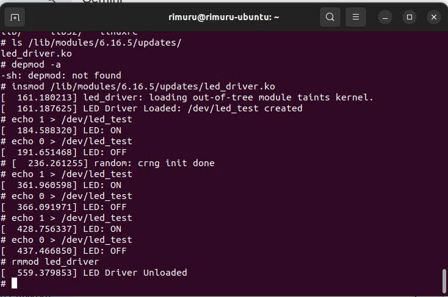
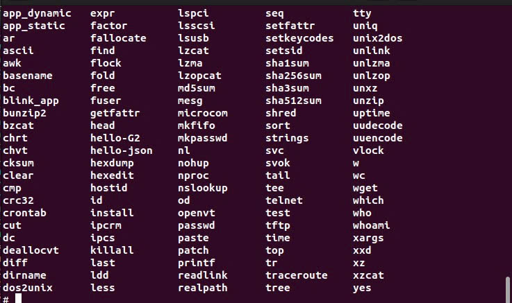
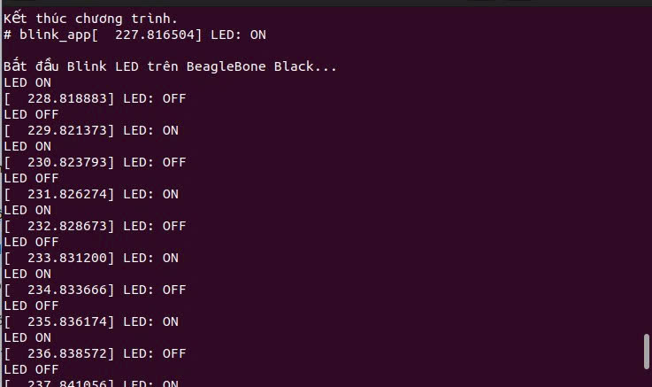

# 🔆 BeagleBone Black — LED GPIO Kernel Driver Series -Nhom 2

> Chuỗi 3 bài thực hành xây dựng Linux Kernel Driver điều khiển LED rời trên **BeagleBone Black (BBB)** sử dụng hệ điều hành tùy chỉnh từ **Buildroot**.

---

## Mục lục

- [Bài 1: Kernel Driver GPIO LED](#bài-1-kernel-driver-gpio-led)
- [Bài 2: User-space Blink Application](#bài-2-user-space-blink-application)
- [Bài 3: Auto-Start Service](#bài-3-auto-start-service)
- [Tóm tắt kiến trúc hệ thống](#tóm-tắt-kiến-trúc-hệ-thống)

---

## Bài 1: Kernel Driver GPIO LED

### Mục tiêu

Xây dựng một **Linux Kernel Module** (Character Device Driver) để điều khiển LED rời gắn vào chân GPIO của BeagleBone Black thông qua Buildroot.

---

### 1. Chuẩn bị phần cứng

| Linh kiện | Số lượng |
|-----------|----------|
| BeagleBone Black (BBB) | 1 |
| Đèn LED | 1 |
| Điện trở 220Ω | 1 |
| Dây cắm, Breadboard | — |

**Sơ đồ kết nối:**

```
P8_11 (GPIO 525)  ──►  Cực dương LED (chân dài)
Cực âm LED (chân ngắn)  ──►  Điện trở 220Ω  ──►  P8_1 / P8_2 (GND)
```

---

### 2. Xác định số chân GPIO

Trong Kernel phiên bản mới, số GPIO **không** còn tính theo công thức `32 × bank + offset`. Cần kiểm tra trực tiếp trên board:

```bash
mount -t debugfs none /sys/kernel/debug
cat /sys/kernel/debug/gpio
```

> Kết quả xác nhận: Chân **P8_11** tương ứng với **GPIO 525**.

---

### 3. Mã nguồn

**File:** `package/led_driver/src/led_driver.c`

```c
#include <linux/module.h>
#include <linux/kernel.h>
#include <linux/fs.h>
#include <linux/uaccess.h>
#include <linux/gpio.h>
#include <linux/device.h>

#define DEVICE_NAME "led_test"
#define CLASS_NAME  "led_class"
#define GPIO_LED    525

static int major_number;
static struct class*  led_class  = NULL;
static struct device* led_device = NULL;

static ssize_t dev_write(struct file *file, const char __user *user_buffer,
                         size_t count, loff_t *ppos) {
    char val;
    if (copy_from_user(&val, user_buffer, 1)) return -EFAULT;
    if (val == '1') {
        gpio_set_value(GPIO_LED, 1);
        printk(KERN_INFO "LED: ON\n");
    } else if (val == '0') {
        gpio_set_value(GPIO_LED, 0);
        printk(KERN_INFO "LED: OFF\n");
    }
    return count;
}

static struct file_operations fops = { .write = dev_write };

static int __init led_driver_init(void) {
    major_number = register_chrdev(0, DEVICE_NAME, &fops);
    led_class  = class_create(CLASS_NAME);   /* Kernel 6.4+ */
    led_device = device_create(led_class, NULL, MKDEV(major_number, 0), NULL, DEVICE_NAME);
    if (gpio_is_valid(GPIO_LED)) {
        gpio_request(GPIO_LED, "led_gpio");
        gpio_direction_output(GPIO_LED, 0);
    }
    printk(KERN_INFO "LED Driver Loaded: /dev/%s created\n", DEVICE_NAME);
    return 0;
}

static void __exit led_driver_exit(void) {
    gpio_set_value(GPIO_LED, 0);
    gpio_free(GPIO_LED);
    device_destroy(led_class, MKDEV(major_number, 0));
    class_destroy(led_class);
    unregister_chrdev(major_number, DEVICE_NAME);
    printk(KERN_INFO "LED Driver Unloaded\n");
}

module_init(led_driver_init);
module_exit(led_driver_exit);
MODULE_LICENSE("GPL");
MODULE_AUTHOR("Rimuru");
```

---

### 4. Cấu hình Buildroot

**File:** `package/led_driver/Config.in`

```kconfig
config BR2_PACKAGE_LED_DRIVER
    bool "led_driver"
    depends on BR2_LINUX_KERNEL
    help
      Kernel module to control LED on P8_11.
```

**File:** `package/led_driver/led_driver.mk`

```makefile
LED_DRIVER_VERSION    = 1.0
LED_DRIVER_SITE       = $(TOPDIR)/package/led_driver/src
LED_DRIVER_SITE_METHOD = local

$(eval $(kernel-module))
$(eval $(generic-package))
```

---

### 5. Biên dịch & Nạp firmware

```bash
# Bước 1 — Build image
make led_driver-rebuild
make

# Bước 2 — Xác định tên thiết bị thẻ nhớ (cẩn thận!)
lsblk

# Bước 3 — Ghi image ra SD Card
cd ~/Documents/buildroot/
sudo dd if=output/images/sdcard.img of=/dev/sda bs=4M status=progress conv=fsync
sync
```

> **Lưu ý:** Kiểm tra đúng tên thiết bị (`/dev/sda`, `/dev/sdb`, …) trước khi chạy `dd` để tránh mất dữ liệu.

---

### 6. Kiểm tra trên BeagleBone Black

```bash
# Nạp module
insmod /lib/modules/6.16.5/updates/led_driver.ko

# Kiểm tra device node
ls -l /dev/led_test

# Điều khiển LED
echo 1 > /dev/led_test   # LED Sáng
echo 0 > /dev/led_test   # LED Tắt

# Xem log hệ thống
dmesg | tail

# Gỡ module
rmmod led_driver
```

**Demo thực tế — Bài 1:**



> Terminal xác nhận: driver nạp thành công, `/dev/led_test` được tạo, LED bật/tắt theo lệnh `echo`, driver gỡ sạch bằng `rmmod`.

---

## Bài 2: User-space Blink Application

### Mục tiêu

Viết, đóng gói và triển khai một **ứng dụng C (User-space)** trong Buildroot để giao tiếp với driver LED đã tạo ở Bài 1, thực hiện chức năng **chớp tắt (Blink)** LED tự động.

**Kiến thức đạt được:**
- Giao tiếp với Kernel Driver qua **File Operations** (`open`, `write`, `close`)
- Đóng gói ứng dụng C thành **Buildroot Package** dùng `generic-package`
- Sử dụng **Cross-compiler** biên dịch mã nguồn cho kiến trúc ARM

---

### 1. Cấu trúc thư mục

```
buildroot/
└── package/
    └── led_blink_app/
        ├── Config.in           # Cấu hình menuconfig
        ├── led_blink_app.mk    # Hướng dẫn build & install
        └── src/
            ├── led_blink_app.c  # Mã nguồn C
            └── Makefile         # Makefile nội bộ (tùy chọn)
```

---

### 2. Mã nguồn ứng dụng

**File:** `package/led_blink_app/src/led_blink_app.c`

```c
#include <stdio.h>
#include <stdlib.h>
#include <fcntl.h>
#include <unistd.h>

#define DEVICE_PATH "/dev/led_test"

int main() {
    int fd = open(DEVICE_PATH, O_WRONLY);
    if (fd < 0) {
        perror("Lỗi: Không tìm thấy Driver! Hãy insmod led_driver trước");
        return -1;
    }

    printf("Bắt đầu Blink LED (10 lần)...\n");
    for (int i = 0; i < 10; i++) {
        write(fd, "1", 1);   /* Bật LED */
        printf("LED ON\n");
        sleep(1);
        write(fd, "0", 1);   /* Tắt LED */
        printf("LED OFF\n");
        sleep(1);
    }

    printf("Kết thúc chương trình.\n");
    close(fd);
    return 0;
}
```

---

### 3. Cấu hình Buildroot

**File:** `package/led_blink_app/Config.in`

```kconfig
config BR2_PACKAGE_LED_BLINK_APP
    bool "led_blink_app"
    help
      Ứng dụng C thực hiện chớp tắt LED qua led_driver.
```

**File:** `package/led_blink_app/led_blink_app.mk`

```makefile
LED_BLINK_APP_VERSION    = 1.0
LED_BLINK_APP_SITE       = $(TOPDIR)/package/led_blink_app/src
LED_BLINK_APP_SITE_METHOD = local

define LED_BLINK_APP_BUILD_CMDS
    $(TARGET_CC) $(TARGET_CFLAGS) $(@D)/led_blink_app.c \
        -o $(@D)/blink_app $(TARGET_LDFLAGS)
endef

define LED_BLINK_APP_INSTALL_TARGET_CMDS
    $(INSTALL) -D -m 0755 $(@D)/blink_app $(TARGET_DIR)/usr/bin/blink_app
endef

$(eval $(generic-package))
```

---

### 4. Biên dịch & Nạp firmware

```bash
# Bước 1 — Chọn package trong menuconfig
make menuconfig
# Điều hướng: Target packages → Miscellaneous → [*] led_blink_app

# Bước 2 — Build app và image
make led_blink_app-rebuild
make

# Bước 3 — Ghi image ra SD Card
cd ~/Documents/buildroot/
sudo dd if=output/images/sdcard.img of=/dev/sda bs=4M status=progress conv=fsync
sync
```

---

### 5. Kiểm tra trên BeagleBone Black

**Trường hợp 1 — Chạy đúng quy trình:**

```bash
modprobe led_driver   # Nạp driver
blink_app             # Chạy ứng dụng
```

> LED chớp tắt 10 lần, terminal hiển thị log `LED ON` / `LED OFF` song song với log Kernel.

**Demo thực tế — Bài 2 (danh sách binary trong rootfs):**




> `blink_app` được cross-compile và cài đặt thành công vào rootfs — thấy rõ trong danh sách lệnh của hệ thống.

**Trường hợp 2 — Kiểm tra xử lý lỗi (chưa nạp driver):**

```bash
rmmod led_driver   # Gỡ driver
blink_app          # Chạy ứng dụng
```

> Hệ thống in ra: `Lỗi: Không tìm thấy Driver! ...: No such file or directory`  
> Board vẫn hoàn toàn an toàn — không gây hỏng hóc phần cứng.

---

## Bài 3: Auto-Start Service

### Mục tiêu

- Tự động **nạp Kernel Module** (`led_driver.ko`) ngay khi hệ thống khởi động
- Tự động **thực thi ứng dụng** (`blink_app`) ở chế độ nền (background)
- Quản lý dịch vụ thông qua **Init Scripts** (`/etc/init.d/`)

---

### 1. Phương pháp thực hiện

Sử dụng **Custom Package** trong Buildroot (thay vì Overlay) để đảm bảo tính module hóa và quản lý linh hoạt qua `menuconfig`.

**Cấu trúc thư mục:**

```
buildroot/package/led_autostart/
├── Config.in           # Cấu hình menuconfig
├── led_autostart.mk    # Lệnh cài đặt script vào rootfs
└── S99led_autostart    # Init script (cài vào /etc/init.d/ trên board)
```

---

### 2. Init Script

**File:** `package/led_autostart/S99led_autostart`

```sh
#!/bin/sh

case "$1" in
  start)
    printf "Starting Auto Blink Service: "
    modprobe led_driver          # Nạp module driver
    /usr/bin/blink_app &         # Chạy app ở chế độ background
    echo "OK"
    ;;
  stop)
    printf "Stopping Auto Blink Service: "
    killall blink_app
    rmmod led_driver
    echo "OK"
    ;;
  *)
    echo "Usage: $0 {start|stop}"
    exit 1
    ;;
esac
```

> Tên `S99` đảm bảo script chạy **sau tất cả** các service khác trong quá trình boot.

---

### 3. Cấu hình Buildroot

**File:** `package/led_autostart/Config.in`

```kconfig
config BR2_PACKAGE_LED_AUTOSTART
    bool "led_autostart"
    depends on BR2_PACKAGE_LED_DRIVER
    depends on BR2_PACKAGE_LED_BLINK_APP
    help
      Tự động nạp led_driver và chạy blink_app khi khởi động.
```

**File:** `package/led_autostart/led_autostart.mk`

```makefile
LED_AUTOSTART_VERSION    = 1.0
LED_AUTOSTART_SITE       = $(TOPDIR)/package/led_autostart
LED_AUTOSTART_SITE_METHOD = local

define LED_AUTOSTART_INSTALL_TARGET_CMDS
    $(INSTALL) -D -m 0755 $(@D)/S99led_autostart \
        $(TARGET_DIR)/etc/init.d/S99led_autostart
endef

$(eval $(generic-package))
```

Thêm vào `package/Config.in`:

```kconfig
source "package/led_autostart/Config.in"
```

---

### 4. Kích hoạt trong menuconfig

```bash
make menuconfig
# Điều hướng: Target packages → Miscellaneous → [*] led_autostart
```

---

### 5. Build & Flash

```bash
make led_autostart-rebuild
make

cd ~/Documents/buildroot/
sudo dd if=output/images/sdcard.img of=/dev/sda bs=4M status=progress conv=fsync
sync
```

---

### 6. Kết quả đạt được

| Hạng mục | Kết quả |
|----------|---------|
| **Quá trình boot** | Script `S99led_autostart` tự động được gọi ngay sau khi Kernel khởi động |
| **Trạng thái driver** | `lsmod` xác nhận `led_driver` được nạp tự động |
| **Hoạt động LED** | LED tại chân P8_11 nhấp nháy đúng 10 lần rồi tự dừng |
| **Tương tác terminal** | Hệ thống không bị treo — người dùng vẫn đăng nhập bình thường trong khi LED đang nháy |

**Demo thực tế — Bài 3 (blink_app chạy tự động khi boot):**

> Log terminal xác nhận: `blink_app` chạy tự động ngay sau boot, LED bật/tắt liên tục với chu kỳ ~1 giây, kernel log và user log hiển thị xen kẽ.


