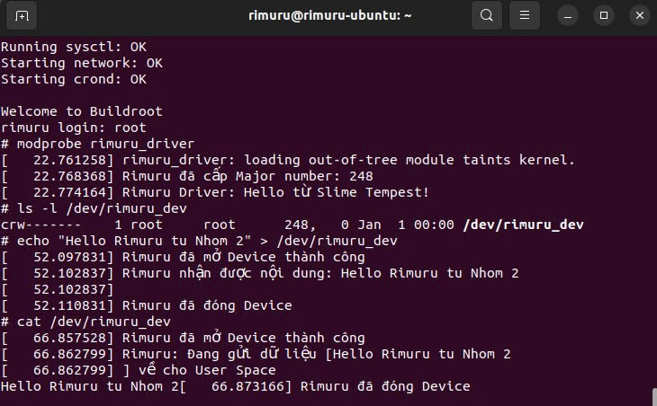

# BeagleBone Black — Custom Character Driver: Rimuru Driver (Group 2)

Dự án này thực hiện xây dựng một **Linux Kernel Module (Character Device Driver)** chạy trên nền tảng **BeagleBone Black (AM335x)**. Hệ điều hành được tùy chỉnh bằng công cụ **Buildroot**.

---

## 1. Mục tiêu bài thực hành

- Xây dựng cấu trúc Driver hoàn chỉnh (Init, Exit, Open, Release, Read, Write)
- Cơ chế tự động cấp phát Major Number và tạo Device Node trong `/dev/`
- Giao tiếp dữ liệu giữa User Space và Kernel Space thông qua `copy_to_user` và `copy_from_user`
- Kiểm thử tính năng trên BeagleBone Black

---

## 2. Cấu trúc Package trong Buildroot

Package được tổ chức theo quy tắc của Buildroot để tự động hóa việc biên dịch:

```
package/rimuru_driver/
├── Config.in               # Cấu hình Menuconfig
├── rimuru_driver.mk        # Chỉ thị biên dịch của Buildroot
└── src/
    ├── Makefile            # Kbuild cho Kernel Module
    └── rimuru_driver.c     # Mã nguồn C của Driver
```

---

## 3. Nội dung kỹ thuật

### 3.1. Kernel Driver (rimuru_driver.c)

Driver thực hiện đăng ký một thiết bị ký tự. Khi User ghi dữ liệu, Driver lưu vào một vùng đệm (`rimuru_buffer`) và sẵn sàng nhả lại dữ liệu khi User đọc.

**Các hàm quan trọng:**

| Hàm | Mô tả |
|-----|-------|
| `dev_open()` | Mở thiết bị |
| `dev_release()` | Đóng thiết bị |
| `dev_read()` | Đọc dữ liệu từ kernel → user space (sử dụng `copy_to_user`) |
| `dev_write()` | Ghi dữ liệu từ user space → kernel (sử dụng `copy_from_user`) |
| `rimuru_driver_init()` | Hàm khởi tạo - đăng ký character device |
| `rimuru_driver_exit()` | Hàm thoát - hủy đăng ký character device |

**Mã nguồn (rimuru_driver.c):**

```c
#include <linux/module.h>
#include <linux/kernel.h>
#include <linux/fs.h>          // Thư viện cho Character Device (register_chrdev)
#include <linux/device.h>      // Thư viện cho class_create, device_create
#include <linux/uaccess.h>     // Thư viện cho copy_to_user và copy_from_user

#define DEVICE_NAME "rimuru_dev"
#define CLASS_NAME  "rimuru_class"

#define SIZE    1024

static int major_number;
static struct class* char_class  = NULL; 
static struct device* char_device = NULL;
static char rimuru_buffer[SIZE]; 


static int dev_open(struct inode *inodep, struct file *filep) {
    printk(KERN_INFO "Rimuru đã mở Device thành công \n");
    return 0;
}

static int dev_release(struct inode *inodep, struct file *filep) {
    printk(KERN_INFO "Rimuru đã đóng Device \n");
    return 0;
}


static ssize_t dev_write(struct file *file, const char __user *user_buffer, size_t count, loff_t *ppos) {
    if (count > SIZE - 1) count = SIZE - 1; 

    if (copy_from_user(rimuru_buffer, user_buffer, count)) {
        return -EFAULT;
    }

    rimuru_buffer[count] = '\0';
    printk(KERN_INFO "Rimuru nhận được nội dung: %s\n", rimuru_buffer);
    
    return count;
}


static ssize_t dev_read(struct file *file, char __user *user_buffer, size_t count, loff_t *ppos) {
    if (*ppos > 0) return 0;
    if (count > strlen(rimuru_buffer)) count = strlen(rimuru_buffer);

    if (copy_to_user(user_buffer, rimuru_buffer, count)) {
        return -EFAULT;
    }

    printk(KERN_INFO "Rimuru: Đang gửi dữ liệu [%s] về cho User Space\n", rimuru_buffer);

    *ppos += count;
    return count;
}


static struct file_operations fops = {
    .open = dev_open,
    .read = dev_read,
    .write = dev_write,
    .release = dev_release,
};


static int __init rimuru_driver_init(void) {
    // cấp phát major 
    major_number = register_chrdev(0, DEVICE_NAME, &fops);
    if (major_number < 0) {
        printk(KERN_ALERT "Rimuru Không thể đăng ký Major number\n");
        return major_number;
    }
    printk(KERN_INFO "Rimuru đã cấp Major number: %d\n", major_number);
    // Tạo class
    char_class = class_create(CLASS_NAME);
    if (IS_ERR(char_class)) {
        unregister_chrdev(major_number, DEVICE_NAME);
        return PTR_ERR(char_class);
    }

    // Tạo device
    char_device = device_create(char_class, NULL, MKDEV(major_number, 0), NULL, DEVICE_NAME);
    if (IS_ERR(char_device)) {
        class_destroy(char_class);
        unregister_chrdev(major_number, DEVICE_NAME);
        return PTR_ERR(char_device);
    }
    printk(KERN_INFO "Rimuru Driver: Hello từ Slime Tempest!\n");
    return 0;
}
static void __exit rimuru_driver_exit(void) {
    device_destroy(char_class, MKDEV(major_number, 0)); 
    class_destroy(char_class);                        
    unregister_chrdev(major_number, DEVICE_NAME);     
    printk(KERN_INFO "Rimuru Driver: Tạm biệt, Module đã được gỡ\n");
}

module_init(rimuru_driver_init);
module_exit(rimuru_driver_exit);

MODULE_LICENSE("GPL");
MODULE_AUTHOR("Rimuru - Nhom 2");

```

### 3.2. Cấu hình Buildroot (rimuru_driver.mk)

Sử dụng hạ tầng kernel-module để liên kết với mã nguồn Linux Kernel hiện tại.

```makefile
RIMURU_DRIVER_VERSION = 1.0
RIMURU_DRIVER_SITE = $(TOPDIR)/package/rimuru_driver/src
RIMURU_DRIVER_SITE_METHOD = local

#Kernel Module
$(eval $(kernel-module))
#package Module
$(eval $(generic-package))
```

### 3.3. Cấu hình Menuconfig (Config.in)

```
config BR2_PACKAGE_RIMURU_DRIVER
	bool "rimuru_driver"
	depends on BR2_LINUX_KERNEL
	help
	  Linux Kernel Driver cho phep doc/ghi du lieu 
	  giua User Space va Kernel Space.
	  Project cua Rimuru - Nhom 2.

```

### 3.4. Makefile cho Kernel Module

```makefile
obj-m += rimuru_driver.o

all:
	$(MAKE) -C $(LINUX_DIR) M=$(PWD) modules

clean:
	$(MAKE) -C $(LINUX_DIR) M=$(PWD) clean

```

---

## 4. Quy trình triển khai

### Bước 1: Chuẩn bị Buildroot

1. Copy package vào `buildroot/package/Config.in`
2. Cấu hình package trong Menuconfig:

```bash
cd /path/to/buildroot
make menuconfig
# Chọn: Target packages → Miscellaneous → rimuru_driver
```

### Bước 2: Biên dịch

Tại thư mục gốc của Buildroot:

```bash
make rimuru_driver-rebuild
make
```

### Bước 3: Nạp và kiểm tra trên BeagleBone Black

Sau khi boot hệ thống, thực hiện các lệnh sau:

#### 3.1. Nạp Module

```bash
modprobe rimuru_driver
```

Kiểm tra dmesg/log hệ thống sẽ báo Major number được cấp (ví dụ: 248):

```bash
dmesg | tail -5
```

#### 3.2. Kiểm tra Device Node

```bash
ls -l /dev/rimuru_dev
```

Nếu chưa tồn tại, tạo thủ công:

```bash
mknod /dev/rimuru_dev c <MAJOR> 0
```

#### 3.3. Giao tiếp Write (User → Kernel)

Ghi dữ liệu vào driver:

```bash
echo "Rimuru Tempest Nhom 2" > /dev/rimuru_dev
```

Kiểm tra log:

```bash
dmesg | grep rimuru
```

#### 3.4. Giao tiếp Read (Kernel → User)

Đọc dữ liệu từ driver:

```bash
cat /dev/rimuru_dev
```

---

## 5. Kết quả đạt được (Demo)

Dưới đây là kết quả thực tế thu được từ Terminal:



