# Bài Tập: Sử Dụng Các Công Cụ Gỡ Lỗi và Đánh Giá Hiệu Năng Cơ Bản

**Mục tiêu:** Thực hành các công cụ debug và profiling trên BeagleBone Black (BBB) sử dụng Buildroot.

**Môi trường:**
- Host: Ubuntu (~/Documents/buildroot)
- Target: BeagleBone Black, kết nối USB, IP `192.168.7.2`
- Buildroot toolchain: `arm-none-linux-gnueabihf`

---

## Cấu Trúc Package Tạo Ra

```
buildroot/package/
├── demo/                    # Chương trình demo cho GDB (Bài 2.2)
│   ├── Config.in
│   ├── demo.mk
│   └── src/
│       ├── demo.c
│       └── Makefile
├── leak/                    # Chương trình có memory leak (Bài 2.3)
│   ├── Config.in
│   ├── leak.mk
│   └── src/
│       ├── leak.c
│       └── Makefile
└── crash/                   # Chương trình gây segfault (Bài 2.4)
    ├── Config.in
    ├── crash.mk
    └── src/
        ├── crash.c
        └── Makefile
```

---

## Kết Nối BBB Qua USB

```bash
# Thêm IP cho interface USB
sudo ip addr add 192.168.7.1/24 dev enx02ddbbccdd02
sudo ip link set enx02ddbbccdd02 up

# SSH vào BBB
ssh root@192.168.7.2
```

> `enx02ddbbccdd02` là tên interface USB của BBB, có thể khác tùy máy host. Kiểm tra bằng `ip link show`.

---

## Bài 2.1: Cài Đặt gdbserver Trên Target

### Bật gdbserver trong Buildroot

```bash
cd ~/Documents/buildroot
make menuconfig
# → Toolchain → [*] Copy gdb server to the Target
```

### gdbserver có sẵn trong external toolchain

Vì dùng external toolchain (Arm GNU 14.2), gdbserver nằm sẵn trong toolchain:

```bash
find output/host -name "gdbserver"
# output/host/opt/ext-toolchain/arm-none-linux-gnueabihf/libc/usr/bin/gdbserver
```

### Copy lên BBB

```bash
scp output/host/opt/ext-toolchain/arm-none-linux-gnueabihf/libc/usr/bin/gdbserver \
    root@192.168.7.2:/usr/bin/
```

### Kiểm tra

```bash
# Trên BBB
gdbserver --version
# GNU gdbserver (Arm GNU Toolchain 14.2.Rel1) 15.2.90
```

---

## Bài 2.2: GDB Remote Debug Host → Target

### Source Code

**`package/demo/src/demo.c`**
```c
#include <stdio.h>
#include <unistd.h>

int add(int a, int b)
{
    int result = a + b;
    return result;
}

void print_values(int x, int y, int z)
{
    printf("x = %d\n", x);
    printf("y = %d\n", y);
    printf("z = x + y = %d\n", z);
}

int main()
{
    int x = 10;
    int y = 20;
    int z = add(x, y);   /* set breakpoint here */

    print_values(x, y, z);

    for (int i = 0; i < 5; i++) {
        printf("Loop iteration: %d\n", i);
        sleep(1);
    }

    return 0;
}
```

**`package/demo/src/Makefile`**
```makefile
CC     ?= gcc
CFLAGS += -g -O0 -Wall

all: demo

demo: demo.c
	$(CC) $(CFLAGS) -o demo demo.c

clean:
	rm -f demo
```

**`package/demo/Config.in`**
```kconfig
config BR2_PACKAGE_DEMO
    bool "demo"
    help
      Simple demo program for GDB remote debugging.
      Installs /usr/bin/demo on the target.
```

**`package/demo/demo.mk`**
```makefile
################################################################################
#
# demo
#
################################################################################

DEMO_VERSION = 1.0
DEMO_SITE    = $(TOPDIR)/package/demo/src
DEMO_SITE_METHOD = local

define DEMO_BUILD_CMDS
    $(MAKE) $(TARGET_CONFIGURE_OPTS) CFLAGS="$(TARGET_CFLAGS) -g -O0 -U_FORTIFY_SOURCE" -C $(@D)
endef

define DEMO_INSTALL_TARGET_CMDS
    $(INSTALL) -D -m 0755 $(@D)/demo $(TARGET_DIR)/usr/bin/demo
endef

$(eval $(generic-package))
```

> **Lưu ý `-U_FORTIFY_SOURCE`:** Buildroot mặc định thêm `-D_FORTIFY_SOURCE=1` nhưng cờ này không hoạt động với `-O0`. Thêm `-U_FORTIFY_SOURCE` để hủy định nghĩa đó, tránh warning.

### Đăng Ký Package

Thêm vào `package/Config.in`:
```kconfig
source "package/demo/Config.in"
```

### Build

```bash
make menuconfig
# → Target packages → Miscellaneous → [*] demo
make demo
```

### Copy Lên BBB

```bash
# Copy binary chưa strip (có debug symbols)
scp output/build/demo-1.0/demo root@192.168.7.2:/usr/bin/demo
```

### Chạy GDB Remote Debug

**Terminal 1 — Trên BBB (SSH):**
```bash
gdbserver 0.0.0.0:1234 /usr/bin/demo
# Process /usr/bin/demo created; pid = 171
# Listening on port 1234
```

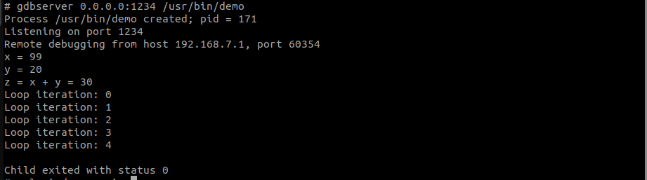

**Terminal 2 — Trên Host:**
```bash
cd ~/Documents/buildroot
output/host/bin/arm-none-linux-gnueabihf-gdb output/build/demo-1.0/demo
```

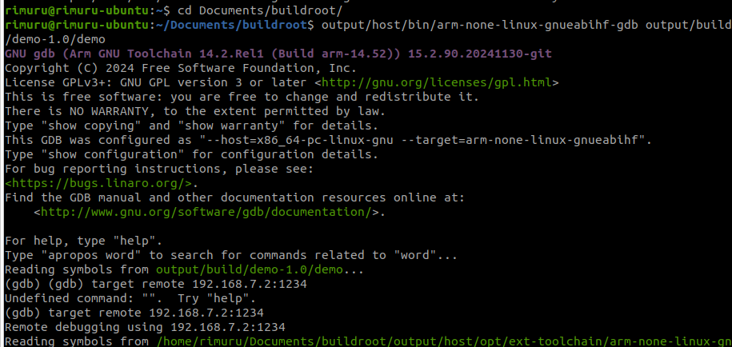

Trong GDB prompt:
```
(gdb) target remote 192.168.7.2:1234
```

### Thực Hành Các Lệnh GDB

#### Thêm / Xóa Breakpoint
```
(gdb) break main              # đặt breakpoint tại hàm main
(gdb) break add               # đặt breakpoint tại hàm add
(gdb) break demo.c:6          # đặt breakpoint tại dòng 6 file demo.c
(gdb) delete 1                # xóa breakpoint số 1
(gdb) info breakpoints        # liệt kê tất cả breakpoints
```

#### Điều Khiển Chạy
```
(gdb) continue                # chạy tiếp đến breakpoint kế tiếp
(gdb) next                    # chạy từng dòng, KHÔNG vào hàm con
(gdb) step                    # chạy từng dòng, CÓ vào trong hàm con
```

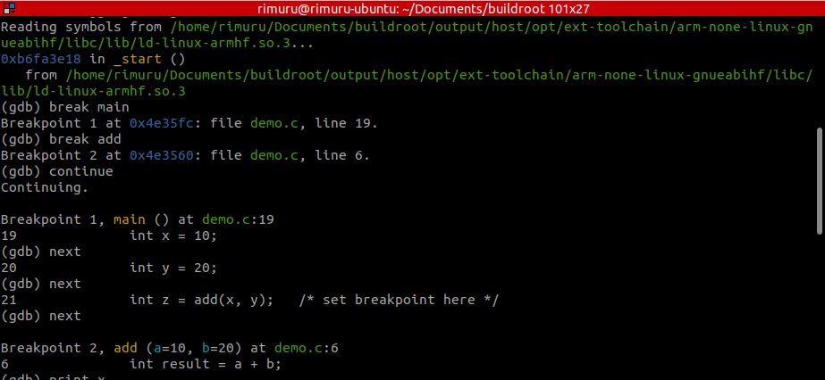

#### In / Gán Giá Trị Biến
```
(gdb) print x                 # in giá trị biến x
(gdb) print a                 # in giá trị tham số a của hàm add
(gdb) set var x = 99          # gán x = 99 (phải đang ở frame chứa x)
```

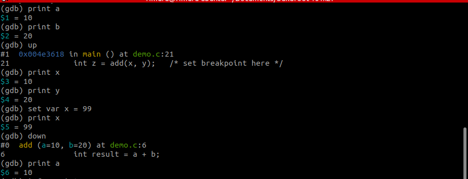

> **Lưu ý pass-by-value:** Khi `set var x = 99` trong frame `main()`, biến `a` trong hàm `add()` vẫn là 10 vì C truyền tham số **bằng giá trị (by value)**. Lúc gọi hàm, giá trị cũ của `x` đã được copy vào `a` trước đó. Muốn thay đổi `a` thì phải dùng `set var a = 99` khi đang ở frame `add()`.

#### Di Chuyển Giữa Stack Frames
```
(gdb) up                      # lên 1 frame (về hàm gọi)
(gdb) down                    # xuống 1 frame (vào hàm được gọi)
(gdb) backtrace               # xem toàn bộ call stack
```

#### Xem Thanh Ghi ARM
```
(gdb) info registers          # xem tất cả thanh ghi
(gdb) print $r0               # xem thanh ghi r0 cụ thể
```

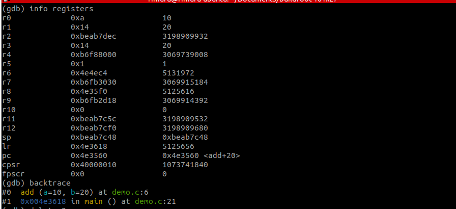

#### Xóa Breakpoint và Kết Thúc

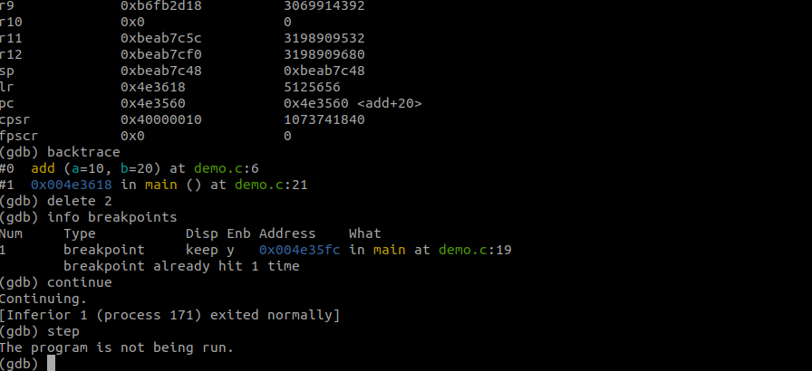

### Kết Quả Chạy Trên BBB


> Lưu ý: `x = 99` vì đã `set var x = 99` trong GDB, chương trình chạy với giá trị đã thay đổi.

---

## Bài 2.3: Phân Tích Bộ Nhớ Với Valgrind

### Source Code

**`package/leak/src/leak.c`**
```c
#include <stdio.h>
#include <stdlib.h>
#include <string.h>

void leak_function()
{
    /* Leak 2: cấp phát nhưng không free */
    char *buf = (char *)malloc(100 * sizeof(char));
    strcpy(buf, "This memory is never freed!");
    printf("%s\n", buf);
    /* thiếu: free(buf); */
}

void double_free_safe()
{
    /* Không leak: cấp phát và free đúng cách */
    int *p = (int *)malloc(sizeof(int));
    *p = 42;
    printf("p = %d\n", *p);
    free(p);
}

int main()
{
    /* Leak 1: cấp phát mảng nhưng không free */
    int *arr = (int *)malloc(10 * sizeof(int));
    for (int i = 0; i < 10; i++)
        arr[i] = i;

    printf("arr[0]=%d, arr[9]=%d\n", arr[0], arr[9]);
    /* thiếu: free(arr); */

    leak_function();
    double_free_safe();

    printf("Program ended without freeing all memory.\n");
    return 0;
}
```

**`package/leak/src/Makefile`**
```makefile
CC     ?= gcc
CFLAGS += -g -O0 -Wall

all: leak

leak: leak.c
	$(CC) $(CFLAGS) -o leak leak.c

clean:
	rm -f leak
```

**`package/leak/Config.in`**
```kconfig
config BR2_PACKAGE_LEAK
    bool "leak"
    help
      Demo program with intentional memory leaks
      for Valgrind analysis.
      Installs /usr/bin/leak on the target.
```

**`package/leak/leak.mk`**
```makefile
################################################################################
#
# leak
#
################################################################################

LEAK_VERSION = 1.0
LEAK_SITE    = $(TOPDIR)/package/leak/src
LEAK_SITE_METHOD = local

define LEAK_BUILD_CMDS
    $(MAKE) $(TARGET_CONFIGURE_OPTS) \
        CFLAGS="$(TARGET_CFLAGS) -g -O0 -U_FORTIFY_SOURCE -no-pie -fno-pie" \
        -C $(@D)
endef

define LEAK_INSTALL_TARGET_CMDS
    $(INSTALL) -D -m 0755 $(@D)/leak $(TARGET_DIR)/usr/bin/leak
endef

$(eval $(generic-package))
```

### Đăng Ký Package

Thêm vào `package/Config.in`:
```kconfig
source "package/leak/Config.in"
```

### Build và Copy Lên BBB

```bash
make menuconfig
# → Target packages → Miscellaneous → [*] leak
make leak

# Copy binary chưa strip lên BBB
scp output/build/leak-1.0/leak root@192.168.7.2:/usr/bin/leak
```

### Cài Valgrind

```bash
make menuconfig
# → Target packages → Debugging, profiling and benchmark
# → [*] valgrind
# → [*]   Memcheck: a memory error detector
make valgrind
```

### Copy Valgrind Lên BBB

```bash
scp output/target/usr/bin/valgrind root@192.168.7.2:/usr/bin/

# Copy thư viện valgrind
scp -r output/target/usr/libexec/valgrind root@192.168.7.2:/usr/libexec/

# Trên BBB — chuyển file vào đúng thư mục
mkdir -p /usr/libexec/valgrind
mv /usr/libexec/*arm-linux* /usr/libexec/valgrind/
mv /usr/libexec/*.xml /usr/libexec/valgrind/
mv /usr/libexec/*.supp /usr/libexec/valgrind/
mv /usr/libexec/*.py /usr/libexec/valgrind/
mv /usr/libexec/*.css /usr/libexec/valgrind/
mv /usr/libexec/*.html /usr/libexec/valgrind/
mv /usr/libexec/*.js /usr/libexec/valgrind/
```

> **Lưu ý:** Khi `scp -r` các file nằm thẳng trong `/usr/libexec/` thay vì `/usr/libexec/valgrind/`. Phải tạo thư mục và move vào mới chạy được.

### Chạy Valgrind

```bash
# Trên BBB
valgrind --leak-check=full --show-leak-kinds=all --track-origins=yes /usr/bin/leak
```

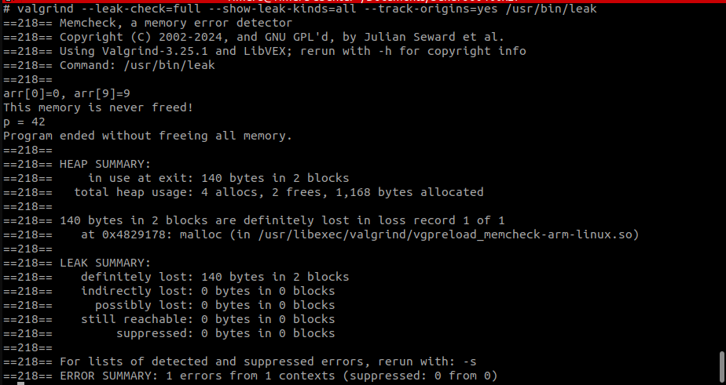

### Phân Tích Kết Quả

| # | Loại lỗi | Kích thước | Vị trí trong code | Nguyên nhân |
|---|---|---|---|---|
| 1 | definitely lost | 40 bytes | `main()` line 26 | `malloc(10 * sizeof(int))` — thiếu `free(arr)` |
| 2 | definitely lost | 100 bytes | `leak_function()` line 8 | `malloc(100)` — thiếu `free(buf)` |
| ✅ | không leak | 4 bytes | `double_free_safe()` | Có `free(p)` đúng cách |

**Giải thích:**
- `4 allocs` = 3 malloc trong code + 1 malloc nội bộ của libc khi khởi động
- `2 frees` = 1 free trong `double_free_safe()` + 1 free nội bộ libc
- `140 bytes = 40 + 100` = tổng 2 block bị leak

### Cách Vá Lỗi

```c
void leak_function()
{
    char *buf = (char *)malloc(100 * sizeof(char));
    strcpy(buf, "This memory is now freed!");
    printf("%s\n", buf);
    free(buf);   /* ✅ đã sửa */
}

int main()
{
    int *arr = (int *)malloc(10 * sizeof(int));
    for (int i = 0; i < 10; i++)
        arr[i] = i;
    printf("arr[0]=%d, arr[9]=%d\n", arr[0], arr[9]);
    free(arr);   /* ✅ đã sửa */

    leak_function();
    double_free_safe();
    return 0;
}
```

---

## Bài 2.4: Phân Tích Core Dump

### Source Code

**`package/crash/src/crash.c`**
```c
#include <stdio.h>
#include <stdlib.h>

void cause_crash()
{
    int *ptr = NULL;
    *ptr = 42;  /* segmentation fault — ghi vào địa chỉ NULL */
}

int main()
{
    printf("Program started.\n");
    printf("About to cause segfault...\n");
    cause_crash();
    printf("This line will never be reached.\n");
    return 0;
}
```

**`package/crash/src/Makefile`**
```makefile
CC     ?= gcc
CFLAGS += -g -O0 -Wall -no-pie -fno-omit-frame-pointer

all: crash

crash: crash.c
	$(CC) $(CFLAGS) -o crash crash.c

clean:
	rm -f crash
```

**`package/crash/Config.in`**
```kconfig
config BR2_PACKAGE_CRASH
    bool "crash"
    help
      Demo program that causes a segmentation fault
      for core dump analysis.
      Installs /usr/bin/crash on the target.
```

**`package/crash/crash.mk`**
```makefile
################################################################################
#
# crash
#
################################################################################

CRASH_VERSION = 1.0
CRASH_SITE    = $(TOPDIR)/package/crash/src
CRASH_SITE_METHOD = local

define CRASH_BUILD_CMDS
    $(MAKE) $(TARGET_CONFIGURE_OPTS) \
        CFLAGS="$(TARGET_CFLAGS) -g -O0 -U_FORTIFY_SOURCE -no-pie -fno-omit-frame-pointer" \
        -C $(@D)
endef

define CRASH_INSTALL_TARGET_CMDS
    $(INSTALL) -D -m 0755 $(@D)/crash $(TARGET_DIR)/usr/bin/crash
endef

$(eval $(generic-package))
```

### Đăng Ký Package

Thêm vào `package/Config.in`:
```kconfig
source "package/crash/Config.in"
```

### Build và Copy Lên BBB

```bash
make menuconfig
# → Target packages → Miscellaneous → [*] crash
make crash

scp output/build/crash-1.0/crash root@192.168.7.2:/usr/bin/crash
```

### Bật Core Dump Trên BBB

```bash
ulimit -c unlimited
echo "core.%e.%p" > /proc/sys/kernel/core_pattern
```

> **Giải thích `core_pattern`:**
> - `%e` = tên chương trình
> - `%p` = PID của process
> - Kết quả: file `core.crash.222` trong thư mục hiện tại

### Tạo Core Dump

```bash
cd /tmp
/usr/bin/crash
# Program started.
# About to cause segfault...
# Segmentation fault (core dumped)

ls -la /tmp/core.*
# -rw------- 1 root root 397312 Jan 1 00:57 /tmp/core.crash.222
```

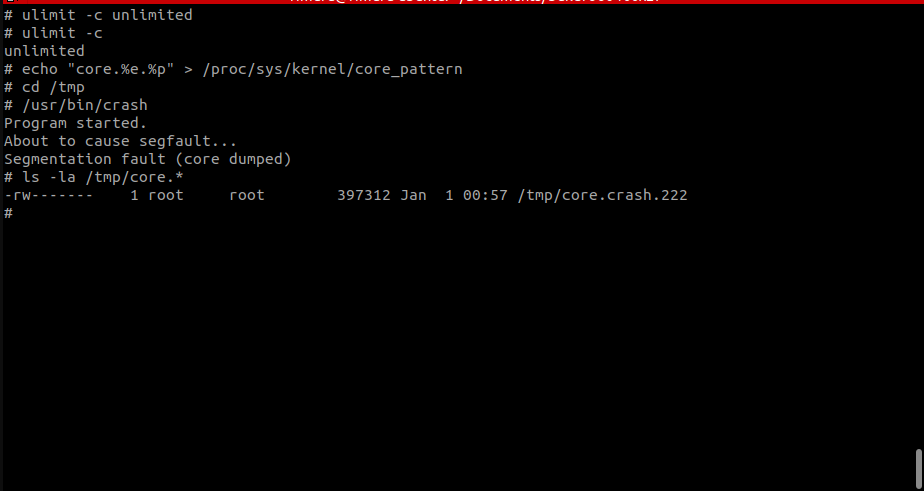

### Copy Core File Về Host và Phân Tích

```bash
# Trên host
scp root@192.168.7.2:/tmp/core.crash.222 .

output/host/bin/arm-none-linux-gnueabihf-gdb \
    output/build/crash-1.0/crash \
    core.crash.222
```

Trong GDB:
```
(gdb) bt
#0  0x00010414 in cause_crash () at crash.c:7
#1  0x0001044c in main () at crash.c:14

(gdb) info registers
r2   0x2a   42        ← giá trị 42 đang cố ghi vào NULL
r3   0x0    0         ← ptr = NULL
pc   0x10414  <cause_crash+28>
```

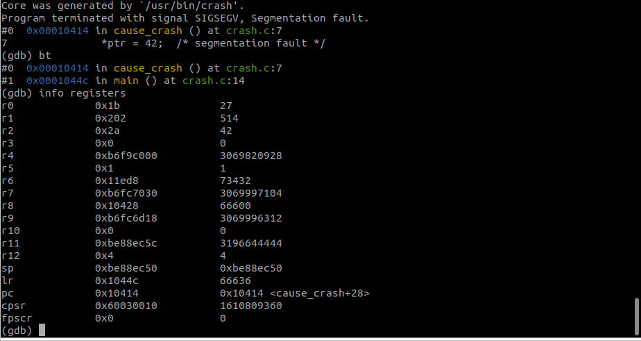

### Phân Tích Kết Quả

| Thông tin | Giá trị | Ý nghĩa |
|---|---|---|
| Crash tại | `crash.c:7` | Dòng `*ptr = 42` |
| `r3 = 0x0` | NULL | `ptr` chứa địa chỉ NULL |
| `r2 = 0x2a` | 42 | Giá trị đang cố ghi |
| `pc = cause_crash+28` | 0x10414 | Program counter dừng tại lệnh gây crash |
| Call stack | `main → cause_crash` | Luồng gọi hàm |

**Nguyên nhân:** Dereferencing NULL pointer — ghi giá trị 42 vào địa chỉ `0x0` (NULL), gây Segmentation Fault.

---

## Bài 2.5: Phân Tích Hiệu Năng Với perf

### Build perf Từ Kernel Source

```bash
cd output/build/linux-6.16.5/tools/perf

make ARCH=arm \
     CROSS_COMPILE=~/Documents/buildroot/output/host/bin/arm-none-linux-gnueabihf- \
     LDFLAGS="-static" \
     NO_LIBELF=1 \
     NO_LIBUNWIND=1 \
     NO_LIBAUDIT=1 \
     NO_LIBNUMA=1 \
     NO_LIBDW_DWARF_UNWIND=1 \
     NO_SLANG=1 \
     NO_GTK2=1 \
     NO_LIBPERL=1 \
     NO_LIBPYTHON=1 \
     NO_LIBTRACEEVENT=1
```

> **Giải thích các flag `NO_*`:** perf có nhiều tính năng tùy chọn phụ thuộc vào các thư viện như libelf, libdw, libpython... Vì cross-compile cho ARM không có sẵn các thư viện này, tắt hết bằng `NO_*=1`. Flag `-static` để binary tự chứa tất cả, không cần shared lib trên BBB.

### Copy Lên BBB

```bash
scp perf root@192.168.7.2:/usr/bin/
ssh root@192.168.7.2 "perf --version"
# perf version 6.16.5
```

### Đo Hiệu Năng

```bash
# Trên BBB
perf stat /usr/bin/demo
```

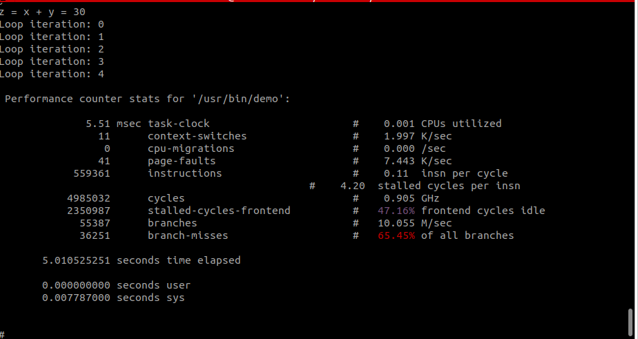

### Phân Tích Kết Quả

| Metric | Giá trị | Phân tích |
|---|---|---|
| `task-clock` | 5.51 msec | CPU thực sự bận chỉ 5.5ms |
| `elapsed time` | 5.01 seconds | Tổng thời gian = 5 × `sleep(1)` |
| `CPUs utilized` | 0.001 | 99.9% thời gian là sleep, không dùng CPU |
| `instructions` | 559,361 | Tổng số lệnh máy thực thi |
| `insn per cycle` | 0.11 | Thấp — CPU thường xuyên chờ |
| `stalled cycles` | 47.16% | Gần nửa cycle bị stall |
| `branch-misses` | 65.45% | Cao — branch predictor hoạt động kém |

### Lưu Báo Cáo

```bash
perf stat /usr/bin/demo 2> /tmp/perf_report.txt
```

---

## Bài 2.6: Phân Tích Tracing Với strace và ltrace

### Cài strace và ltrace

```bash
make menuconfig
# → Target packages → Debugging, profiling and benchmark
# → [*] strace
# → [*] ltrace
make strace ltrace

scp output/target/usr/bin/strace root@192.168.7.2:/usr/bin/
scp output/target/usr/bin/ltrace root@192.168.7.2:/usr/bin/
```

### ltrace Cần Thêm Thư Viện

```bash
scp output/target/usr/lib/libelf.so.1 \
    output/target/usr/lib/libdw.so.1 \
    output/target/usr/lib/libz.so.1 \
    root@192.168.7.2:/usr/lib/
```

Kiểm tra dependencies trên BBB:
```bash
ldd /usr/bin/ltrace
```

### strace — Theo Dõi System Calls

```bash
# Theo dõi chi tiết từng syscall
strace /usr/bin/demo
```
```bash
# strace /usr/bin/demo 2>&1 | head -50
execve("/usr/bin/demo", ["/usr/bin/demo"], 0xbe850dd0 /* 14 vars /) = 0
brk(NULL)                               = 0x429000
mmap2(NULL, 8192, PROT_READ|PROT_WRITE, MAP_PRIVATE|MAP_ANONYMOUS, -1, 0) = 0xb6f87000
access("/etc/ld.so.preload", R_OK)      = -1 ENOENT (No such file or directory)
openat(AT_FDCWD, "/etc/ld.so.cache", O_RDONLY|O_LARGEFILE|O_CLOEXEC) = -1 ENOENT (No such file or directory)
openat(AT_FDCWD, "/lib/libc.so.6", O_RDONLY|O_LARGEFILE|O_CLOEXEC) = 3
read(3, "\177ELF\1\1\1\0\0\0\0\0\0\0\0\0\3\0(\0\1\0\0\0\0317\2\0004\0\0\0"..., 512) = 512
statx(3, "", AT_STATX_SYNC_AS_STAT|AT_NO_AUTOMOUNT|AT_EMPTY_PATH, STATX_BASIC_STATS, {stx_mask=STATX_BASIC_STATS|STATX_MNT_ID, stx_attributes=0, stx_mode=S_IFREG|0755, stx_size=1098236, ...}) = 0
mmap2(NULL, 1135652, PROT_READ|PROT_EXEC, MAP_PRIVATE|MAP_DENYWRITE, 3, 0) = 0xb6e71000
mmap2(0xb6f7a000, 12288, PROT_READ|PROT_WRITE, MAP_PRIVATE|MAP_FIXED|MAP_DENYWRITE, 3, 0x108000) = 0xb6f7a000
mmap2(0xb6f7d000, 37924, PROT_READ|PROT_WRITE, MAP_PRIVATE|MAP_FIXED|MAP_ANONYMOUS, -1, 0) = 0xb6f7d000
close(3)                                = 0
set_tls(0xb6f880c0)                     = 0
set_tid_address(0xb6f87c28)             = 245
set_robust_list(0xb6f87c2c, 12)         = 0
rseq(0xb6f880a0, 0x20, 0, 0xe7f5def3)   = 0
mprotect(0xb6f7a000, 8192, PROT_READ)   = 0
mprotect(0x427000, 4096, PROT_READ)     = 0
mprotect(0xb6fa5000, 8192, PROT_READ)   = 0
ugetrlimit(RLIMIT_STACK, {rlim_cur=81921024, rlim_max=RLIM_INFINITY}) = 0
statx(1, "", AT_STATX_SYNC_AS_STAT|AT_NO_AUTOMOUNT|AT_EMPTY_PATH, STATX_BASIC_STATS, {stx_mask=STATX_BASIC_STATS|STATX_MNT_ID, stx_attributes=0, stx_mode=S_IFIFO|0600, stx_size=0, ...}) = 0
getrandom("\x3c\xb3\xe5\xd8", 4, GRND_NONBLOCK) = 4
brk(NULL)                               = 0x429000
brk(0x44a000)                           = 0x44a000
clock_nanosleep(CLOCK_REALTIME, 0, {tv_sec=1, tv_nsec=0}, 0xbea2fbe0) = 0
clock_nanosleep(CLOCK_REALTIME, 0, {tv_sec=1, tv_nsec=0}, 0xbea2fbe0) = 0
clock_nanosleep(CLOCK_REALTIME, 0, {tv_sec=1, tv_nsec=0}, 0xbea2fbe0) = 0
clock_nanosleep(CLOCK_REALTIME, 0, {tv_sec=1, tv_nsec=0}, 0xbea2fbe0) = 0
clock_nanosleep(CLOCK_REALTIME, 0, {tv_sec=1, tv_nsec=0}, 0xbea2fbe0) = 0
write(1, "x = 10\ny = 20\nz = x + y = 30\nLoo"..., 119x = 10
y = 20
z = x + y = 30
Loop iteration: 0
Loop iteration: 1
Loop iteration: 2
Loop iteration: 3
Loop iteration: 4
) = 119
exit_group(0)                           = ?
+++ exited with 0 +++

ltrace /usr/bin/demo
ltrace: error while loading shared libraries: libelf.so.1: cannot open shared object file: No such file or directory
```
```bash
# Thống kê tổng quan
strace -c /usr/bin/demo
```

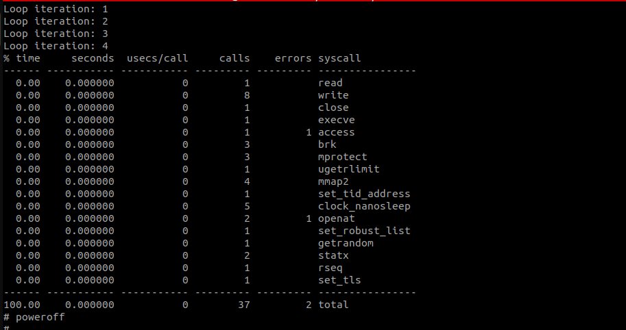

#### Phân Tích strace

| Syscall | Calls | Ý nghĩa |
|---|---|---|
| `execve` | 1 | Khởi chạy chương trình |
| `openat("/lib/libc.so.6")` | 1 | Load shared library libc |
| `mmap2` | 4 | Map thư viện và memory vào process |
| `clock_nanosleep` | 5 | `sleep(1)` × 5 vòng lặp |
| `write` | 8 | `printf` ghi ra stdout |
| `brk` | 3 | Cấp phát/mở rộng heap |
| `exit_group` | 1 | Thoát chương trình |

### ltrace — Theo Dõi Library Calls

```bash
ltrace /usr/bin/demo
```

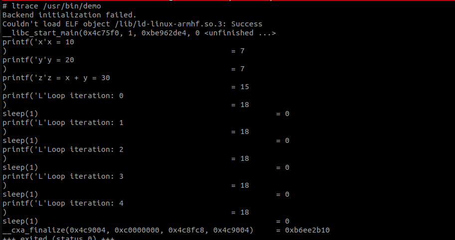

#### Phân Tích ltrace

| Library call | Calls | Ý nghĩa |
|---|---|---|
| `__libc_start_main` | 1 | Libc khởi tạo môi trường chạy cho `main()` |
| `printf` | 8 | Gọi hàm printf từ libc để in ra màn hình |
| `sleep(1)` | 5 | Gọi hàm sleep từ libc, ngủ 1 giây mỗi lần |
| `__cxa_finalize` | 1 | Libc dọn dẹp các destructor trước khi thoát |

### So Sánh strace vs ltrace

| | strace | ltrace |
|---|---|---|
| **Theo dõi** | System calls (kernel) | Library calls (userspace) |
| **Ví dụ** | `write`, `mmap2`, `openat` | `printf`, `malloc`, `sleep` |
| **Cấp độ** | Kernel — userspace boundary | Trong userspace |
| **Dùng khi** | Debug IO, file, network, process | Debug logic dùng thư viện |

---

## Tổng Kết

| Bài | Tool | Mục đích | Kết quả |
|---|---|---|---|
| 2.1 | `gdbserver` | Cài debug server trên target | ✅ gdbserver 15.2.90 trên BBB |
| 2.2 | `gdb` remote | Debug từ xa host→BBB | ✅ Breakpoint, step, print, register |
| 2.3 | `valgrind` | Phát hiện memory leak | ✅ 140 bytes definitely lost (2 blocks) |
| 2.4 | core dump + `gdb` | Phân tích crash | ✅ Segfault tại crash.c:7, ptr=NULL |
| 2.5 | `perf` | Đo hiệu năng | ✅ 5.51ms CPU / 5s elapsed, 47% stall |
| 2.6 | `strace` + `ltrace` | Theo dõi syscall và library call | ✅ 37 syscalls, 8 printf, 5 sleep |